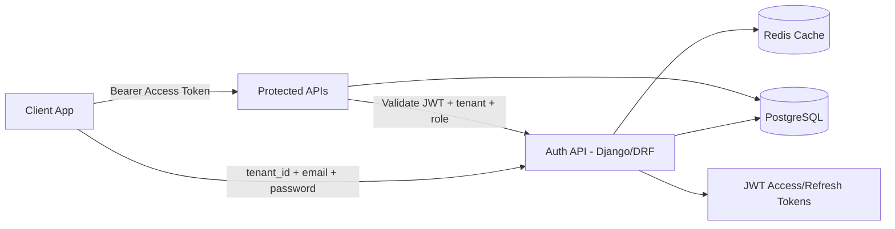
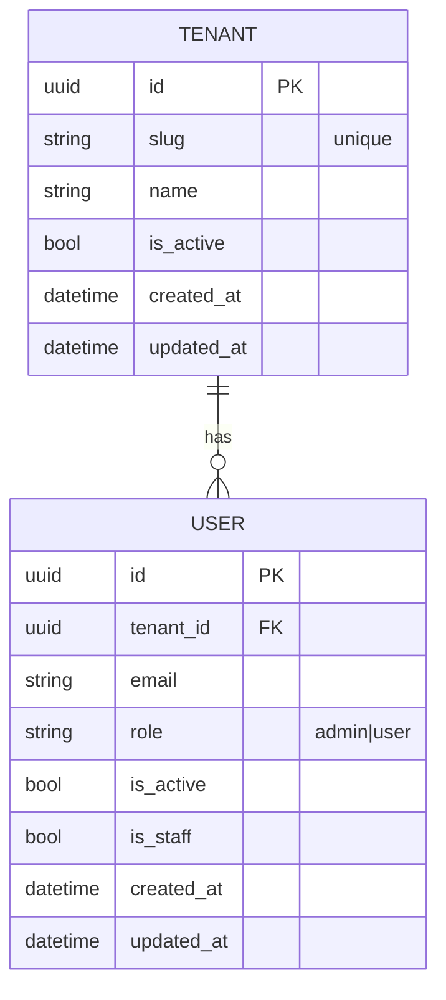
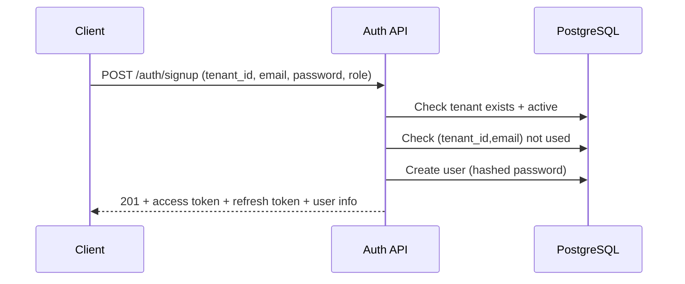
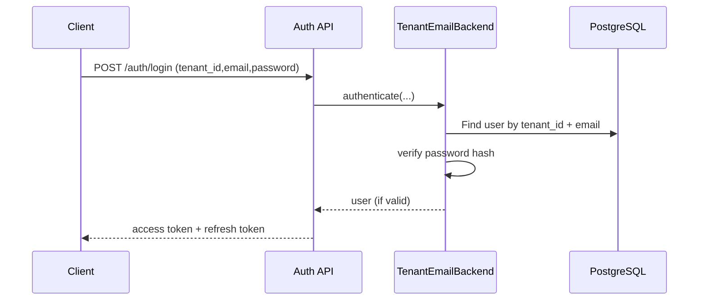
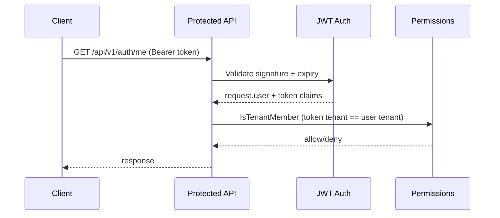
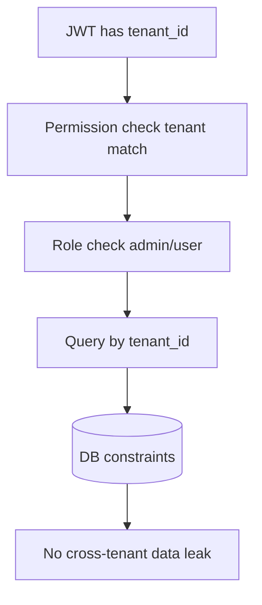

# Multi-Tenant Auth Visual Guide

## 1) High-Level System View

## 2) Data Model (Schema)

> DB rule: unique `(tenant_id, email)`  
> Meaning: same email can exist in different tenants, not duplicated in one tenant.

## 3) Signup Flow

## 4) Login Flow

## 5) Protected API Flow (`/me`, `admin-only`)

For `admin-only`, one more check runs:
- `IsAdminRole` -> `user.role == "admin"`

## 6) Isolation Guardrails

